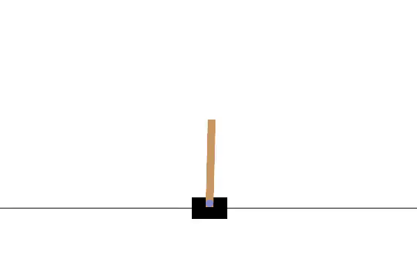

# AI Sim RL (CartPole) - Train/Eval + Video
Besides simulations being cool, implementing AI is used to test.

A minimal, **working** reinforcement learning demo you can extend.
- Trains a PPO agent on `CartPole-v1` (Gymnasium).
- Evaluates and prints metrics.
- Optionally records a short rollout video.

Demo: 



## Quickstart
```bash
python -m venv .venv
# Windows: .venv\Scripts\activate
# macOS/Linux: source .venv/bin/activate
pip install -r requirements.txt

# Train (Will take around 3 minutes)
python src/train.py

# Evaluate
python src/evaluate.py --model-path outputs/cartpole_ppo.zip

# Record a short demo video (saved to videos/)
python src/record_video.py --model-path outputs/cartpole_ppo.zip

# Record video and also export a GIF
python src/record_video.py --model-path outputs/cartpole_ppo.zip --gif
```

## Repo structure
- `src/train.py` trains PPO and saves the model
- `src/evaluate.py` evaluates the saved model (mean reward, success rate)
- `src/record_video.py` records a short video via Gymnasium RecordVideo wrapper
- `outputs/` saved models + plots (created at runtime)
- `videos/` recorded demos (created at runtime)
## Future plans 
- Add a second environment (`Acrobot-v1`), compare training curves
- Add hyperparameter sweep + a short results table
- Add reproducibility (fixed seeds, deterministic eval)